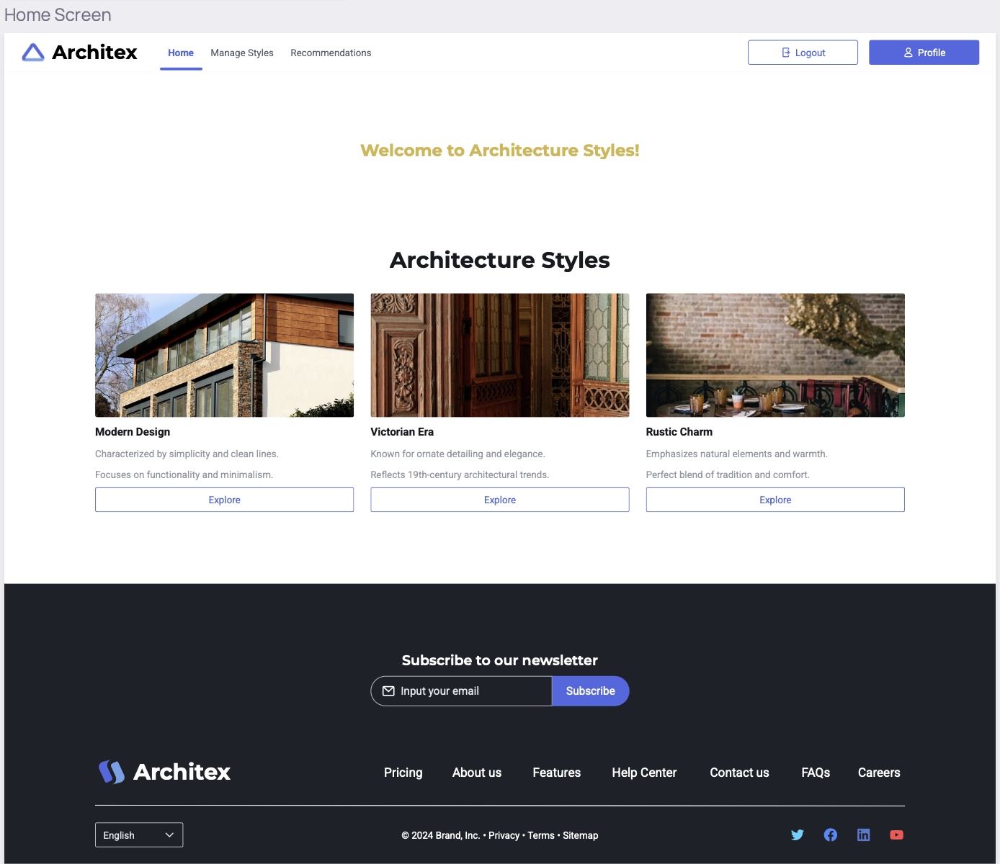
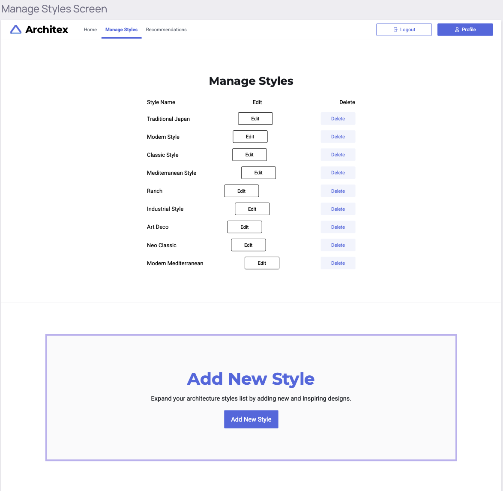
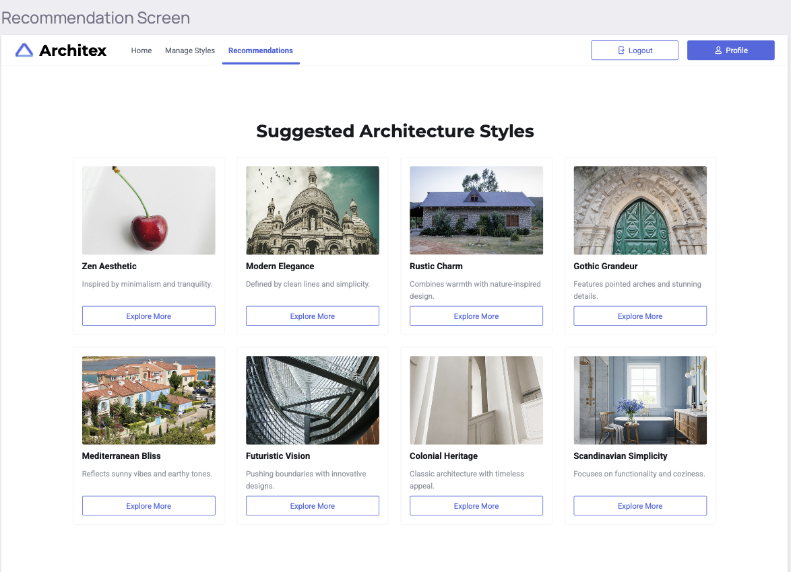
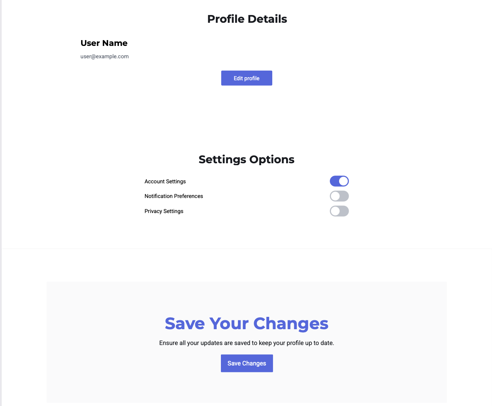

# Phase 1 – Definition and Planning

## 1. User Personas

- **Alex the Architecture Enthusiast:**  
  - **Age:** 28  
  - **Background:** Professional urban architect passionate about sustainable, innovative design.  
  - **Goals:** Discover and compare a wide range of architecture styles; receive AI suggestions that complement his creative vision.  
  - **Pain Points:** Overwhelmed by the volume of available styles; desires quick, accurate insights with detailed characteristics.

- **Bella the Student:**  
  - **Age:** 20  
  - **Background:** Architecture student seeking to understand both historical and modern styles.  
  - **Goals:** Use the app as a learning tool with educational content and clear style definitions.  
  - **Pain Points:** Limited practical experience; requires guidance and context to differentiate between styles.

- **Carlos the Contractor:**  
  - **Age:** 40  
  - **Background:** Independent contractor specializing in renovations and property improvements.  
  - **Goals:** Quickly identify suitable architecture styles for real-world projects with actionable rules and best practices.  
  - **Pain Points:** Time-sensitive decisions; needs concise, project-ready information.

- **Diana the Designer:**  
  - **Age:** 35  
  - **Background:** Interior and architectural designer focused on cohesive, visually appealing designs.  
  - **Goals:** Find detailed visual and textual representations of styles to inspire her projects and client presentations.  
  - **Pain Points:** Requires high-quality visual prototypes and comprehensive style guidelines for clear comparisons.

- **Evan the Entrepreneur:**  
  - **Age:** 30  
  - **Background:** Startup founder in the real estate sector seeking innovative design choices.  
  - **Goals:** Leverage AI to get unique, marketable architecture style recommendations tailored to current trends.  
  - **Pain Points:** Balancing creative innovation with market feasibility; needs data-driven, strategic recommendations.

---

## 2. Use Cases and User Flows

- **Use Case 1: Add Architecture Style**  
  - **Flow:** The user navigates to the "Manage Styles" section, fills in a form with a new style (name, description, images), and submits it. The system validates and saves the input, updating the user's profile.  
  - **Outcome:** The new style is added to the users's style library and factored into future AI recommendations.

- **Use Case 2: Delete Architecture Style**  
  - **Flow:** The user selects an existing style from their library and clicks "Delete." A confirmation dialog appears; upon confirmation, the style is removed from the database.  
  - **Outcome:** The style is permanently deleted, ensuring the user's data remains current.

- **Use Case 3: View Detailed Style Information**  
  - **Flow:** The user clicks on a style card to view comprehensive details including full descriptions, rule sets, images, and related characteristics.  
  - **Outcome:** The user gains in-depth information to support informed decision-making.

- **Use Case 4: Get AI-Powered Style Recommendation**  
  - **Flow:** The user opens a style and add it to favorite. 
  - **Outcome:** The user receives a personalized recommendation that includes actionable design rules and characteristics.

- **Use Case 5: Update User Preferences and Profile**  
  - **Flow:** The user accesses the profile/settings screen to update profile information.
  - **Outcome:** the newly upated information appear on the user's profile.

---

## 3. UI Prototypes

- **Home Screen Prototype:**  
  - **Design Elements:** Clean, modern interface featuring a navigation bar, a card layout showcasing featured architecture styles.
  - **Interactivity:** Dynamic hover effects on style cards.
  

- **Manage Styles Screen Prototype:**  
  - **Design Elements:** A list or grid view displaying user-added styles with clear action buttons for "Add," "Edit," and "Delete."  
  - **Interactivity:** Modal forms for adding/editing styles and confirmation dialogs for deletions.
  

- **Recommendation Screen Prototype:**  
  - **Design Elements:** a results panel that dynamically displays AI-recommended styles with detailed information and visuals.  
  - **Interactivity:** Real-time visual feedback as users adjust preferences and smooth transitions when displaying results.
  

- **Profile/Settings Screen Prototype:**  
  - **Design Elements:** A tabbed layout for user profile details, preferences.  
  - **Interactivity:** Editable fields with inline validation and a responsive design.
  

## 4. Information Architecture and Technical Design

### Information Architecture
- **Site Map:**  
  - **Home:** Overview, featured styles, access to the recommendation engine  
  - **Manage Styles:** Add, delete, and edit architecture styles  
  - **Recommendation Engine:** Display of AI-recommended style details  
  - **Profile/Settings:** User data, preferences
  - **Help/FAQ:** Guidance on app usage and interpretation of recommendations

### Technical Design
- **Frontend:**  
  - **Framework:** React.js for building a dynamic single-page application (SPA)  
  - **Styling:** Bootstrap with custom themes to achieve a modern look  
  
- **Backend:**  
  - **API:** RESTful API built with Node.js (Express)
  - **Database:** PostgreSQL for storing structured user data and architecture styles  
  - **AI Module:** Python-based microservice (using TensorFlow or PyTorch) to analyze user inputs and generate personalized recommendations  
  - **Security:** OAuth 2.0 for authentication, JWT for session management, and HTTPS for secure data transmission

- **Integration:**  
  - **Communication:** JSON over HTTPS between frontend and backend  
  - **Scalability:** Use a microservices architecture with Docker and Kubernetes for deployment  

## 5. Project Management and User Testing

### Project Management
- **Timeline:**  
  - **Weeks 1–2:** In-depth requirement gathering, finalizing user personas, and initial UI/UX planning  
  - **Weeks 3–5:** Creation of detailed wireframes, prototypes, and technical design documentation  
  - **Weeks 6–8:** Development of frontend and backend modules and integration of the AI recommendation engine  
  - **Weeks 8-9:** Internal testing and iterative refinement based on developer feedback   
  - **Week 10:** Final release and production deployment

### User Testing
- **Approach:**  
  - **Alpha Testing:** Conduct internal testing and select power users to catch early bugs and usability issues  
  - **Beta Testing:** Invite a diverse group of target users (aligned with our user personas) to test the app under real-world conditions  
  - **Feedback Mechanism:** Utilize surveys and direct interviews to gather both qualitative and quantitative data  
  - **Metrics:**  
    - **Task Completion Rate:** Evaluate the efficiency with which users complete key tasks (e.g., adding/deleting styles, obtaining recommendations)    
    - **Error Rates:** Monitor error logs and analyze user-reported issues  
    - **Iteration Time:** Track the time required to resolve feedback and implement improvements
.

